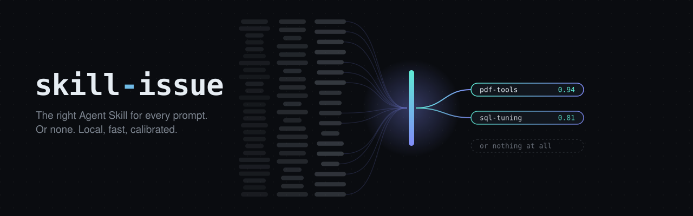
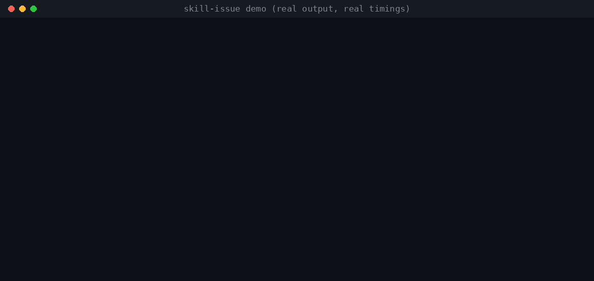
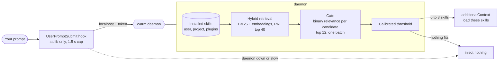
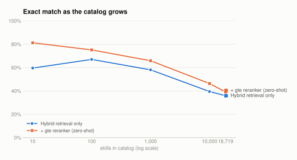
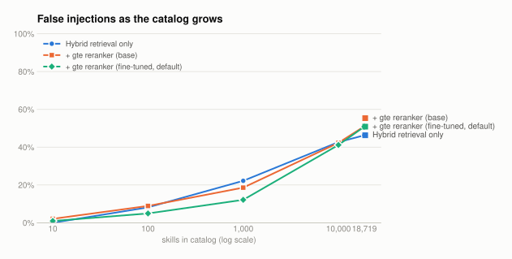
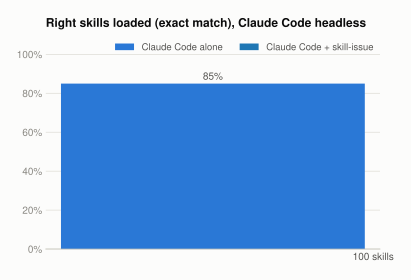
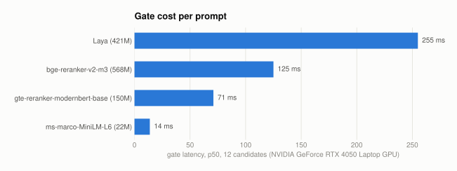
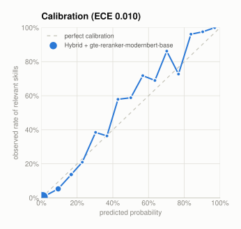

<p align="center">
  
</p>

<p align="center">
  <a href="https://github.com/SahilBachu/skill-issue/actions/workflows/ci.yml"></a>
  <a href="LICENSE"></a>
  
  
  
</p>

**skill-issue** picks the Agent Skills that matter for each prompt, or none, in a fraction of a
second, on your machine. It retrieves candidates from every installed skill (name, description and
body), asks a small calibrated model "is this skill relevant?" for each one, and tells your agent
to load only the ones that clear the bar.

<!-- demo -->
<p align="center">
  
</p>

## Why

Coding agents decide which skill to use by reading every skill's one-line description in their
context. That works for a handful of skills. It degrades as the catalog grows: Claude Code gives
the skill listing about 1% of the context window and starts dropping descriptions when it
overflows. Jiang et al. report the same pattern across agents: as the skill pool grows from 5 to
100, the share of skills agents actually use that are the right ones falls from 29.6% to 3.3%
([arXiv:2608.14036](https://arxiv.org/abs/2608.14036)). skill-issue moves the decision out of the
prompt and into a fast local router that reads the whole skill, not just its description.

## Install

### Claude Code (plugin, recommended)

```text
/plugin marketplace add SahilBachu/skill-issue
/plugin install skill-issue@skill-issue
```

The first session installs the router into the plugin's data folder in the background (needs
[uv](https://docs.astral.sh/uv/) or Python 3.10+) and downloads the models: the gate from this
repository's release, the embedder from Hugging Face.
Prompts work normally meanwhile. Check progress with `skill-issue doctor`.

### Codex, Gemini CLI, Cursor, and other MCP clients

```bash
uv tool install "skillissue[mcp] @ git+https://github.com/SahilBachu/skill-issue"
codex mcp add skill-issue -- skill-issue mcp            # Codex
gemini mcp add -s user skill-issue skill-issue mcp       # Gemini CLI
```

For Cursor, add this to `~/.cursor/mcp.json`:

```json
{ "mcpServers": { "skill-issue": { "command": "skill-issue", "args": ["mcp"] } } }
```

### Companion skill (any agent that supports Agent Skills)

```bash
npx skills add SahilBachu/skill-issue --skill skill-issue
```

It teaches the agent to call `find_skills` (or `skill-issue route`) and how to handle
suggestions safely.

> The repository is private during development. The commands above work once it is public, or
> today for anyone with access and GitHub credentials configured for git.

## How it works



1. **Retrieval.** BM25 over the skill's name, description and body (fields weighted by
   repetition) plus a small embedding model (`bge-small-en-v1.5`), fused with reciprocal rank
   fusion. The body matters: it is where a skill says what it actually does.
2. **Gate.** Each of the top candidates is scored independently: "would this skill help with this
   request?" The gate is a swappable model behind one interface. Scoring candidates one by one,
   instead of asking one model to pick from dozens of options, keeps it accurate as the catalog grows.
   The default gate is `gte-reranker-modernbert-base` fine-tuned for this question (MiniLM-L6 on
   machines without a GPU); see the [model card](docs/model-card.md). The weights download once
   from this repository's `gates-v1` release and are checked against a pinned SHA-256. If that
   download is not possible, the router uses the public base model with its own calibration.
3. **Threshold.** Scores are Platt-calibrated on held-out data, so they behave like probabilities
   (see Calibration below). Skills above the threshold are injected, three at most. Injecting
   nothing is a normal outcome.

The Claude Code hook is a standard-library Python script with a hard timeout. If the daemon is
starting, slow, or broken, the hook prints nothing and your prompt goes through untouched.

A walkthrough of the code, following one prompt from hook to injected hint, is in
[docs/architecture.md](docs/architecture.md).

## Results

<!-- results:findings -->
- **With 1,000 skills installed, Claude Code loaded exactly the right skills for 77% of prompts on
  its own and 93% with skill-issue.** On the same 100 prompts the router fixed 16 and broke none
  (exact McNemar p = 3e-5). Cost per prompt did not change; the median prompt took 0.6 s longer.
- **With 100 skills, Claude Code alone is already at 93%.** skill-issue took it to 96% (3 fixed,
  0 broken), which is within noise at this sample size.
- **Fine-tuning is what made the gate good.** The 150M gte reranker went from 75.1% to 85.8% exact
  match at 100 skills and MiniLM-L6 from 57.9% to 74.4%. Laya went from 35.5% (zero-shot, it never
  said yes) to 83.1%, close to gte but nearly three times its size and slower.
- **Against SkillRouter** (two 0.6B models, about six times the parameters of the default gate
  plus embedder), the fine-tuned gte gate is ahead at 100 and 1,000 skills (85.8% vs 78.4%, 78.2%
  vs 70.0%). At 10,000 and 18,719 skills SkillRouter is slightly ahead (52.6% vs 51.8%, 43.5% vs
  43.3%). On SkillRet it wins clearly: nDCG@10 0.794 against 0.742.
- **Every system degrades as the catalog grows.** At 18,719 skills the best systems reach about 44%
  exact match, a wrong skill is injected for about half of prompts, and the right skill is missing
  from the retrieval top 10 for about one prompt in five. The calibration was fitted at 100 skills;
  at very large catalogs a higher threshold would trade missed skills for fewer wrong ones.
- **The gate is cautious.** On the 64 hand-written prompts, the default gate injected nothing for a
  third of the prompts that had a matching skill, and a wrong skill for 3.1% of prompts.
- **Latency.** With a laptop RTX 4050 the whole hook takes 282 ms at the median on Windows; 152 ms
  of that is starting the Python process and the rest is routing. The fine-tuned MiniLM on CPU
  takes 403 ms. On a GPU the routing itself fits in about 150 ms; the full hook does not on
  Windows, because of process start-up.
<!-- /results:findings -->

### Exact match at 100 installed skills (test split, 527 prompts)

<!-- results:main -->
| System | Exact match | Top-1 | Recall@10 | None acc. | False inj. | F1 | ECE |
|---|---|---|---|---|---|---|---|
| BM25 only | 35.5% | 93.2% | 99.3% | 100.0% | 0.0% | n/a | 0.060 |
| Embeddings only (bge-small) | 65.3% | 86.5% | 97.9% | 98.4% | 6.1% | 65.7% | 0.015 |
| Hybrid BM25 + embeddings | 67.0% | 95.0% | 99.9% | 97.9% | 8.2% | 71.2% | 0.010 |
| SkillRouter (SR-Emb-0.6B + SR-Rank-0.6B) | 78.4% | 97.4% | 100.0% | 98.9% | 6.1% | 82.7% | 0.005 |
| Hybrid + ms-marco-MiniLM-L6 | 57.9% | 86.5% | 99.9% | 97.9% | 6.3% | 55.9% | 0.010 |
| Hybrid + gte-reranker-modernbert-base | 75.1% | 95.9% | 99.9% | 96.3% | 8.9% | 78.4% | 0.010 |
| Hybrid + bge-reranker-v2-m3 | 71.3% | 92.1% | 99.9% | 98.4% | 7.2% | 75.3% | 0.008 |
| Hybrid + Laya (zero-shot) | 35.5% | 15.3% | 99.9% | 100.0% | 0.0% | n/a | 0.004 |
| Hybrid + MiniLM-L6 (fine-tuned) | 74.4% | 93.8% | 99.9% | 94.7% | 13.5% | 80.4% | 0.009 |
| Hybrid + gte-reranker-modernbert (fine-tuned) | 85.8% | 97.9% | 99.9% | 98.9% | 4.9% | 88.9% | 0.007 |
| Hybrid + Laya (fine-tuned) | 83.1% | 96.5% | 99.9% | 98.9% | 5.7% | 87.3% | 0.010 |
<!-- /results:main -->

### Scaling from 10 to 18,719 skills

<picture>
  <source media="(prefers-color-scheme: dark)" srcset="assets/charts/scaling-dark.svg">
  
</picture>

<picture>
  <source media="(prefers-color-scheme: dark)" srcset="assets/charts/false-injection-dark.svg">
  
</picture>

<!-- results:scaling -->
| System | 10 | 100 | 1,000 | 10,000 | 18,719 |
|---|---|---|---|---|---|
| BM25 only | 35.5% | 35.5% | 35.5% | 35.5% | 35.5% |
| Embeddings only (bge-small) | 69.3% | 65.3% | 52.9% | 31.5% | 24.9% |
| Hybrid BM25 + embeddings | 59.6% | 67.0% | 58.1% | 39.5% | 35.9% |
| SkillRouter (SR-Emb-0.6B + SR-Rank-0.6B) | 82.5% | 78.4% | 70.0% | 52.6% | 43.5% |
| Hybrid + ms-marco-MiniLM-L6 | 61.9% | 57.9% | 49.5% | 34.9% | 31.5% |
| Hybrid + gte-reranker-modernbert-base | 81.2% | 75.1% | 65.8% | 46.3% | 39.1% |
| Hybrid + bge-reranker-v2-m3 | 76.3% | 71.3% | 61.9% | 43.8% | 37.2% |
| Hybrid + Laya (zero-shot) | 35.5% | 35.5% | 35.5% | 35.5% | 35.5% |
| Hybrid + MiniLM-L6 (fine-tuned) | 84.6% | 74.4% | 57.7% | 30.0% | 24.1% |
| Hybrid + gte-reranker-modernbert (fine-tuned) | 89.8% | 85.8% | 78.2% | 51.8% | 43.3% |
| Hybrid + Laya (fine-tuned) | 88.2% | 83.1% | 72.9% | 52.6% | 43.8% |
<!-- /results:scaling -->

### Claude Code with and without skill-issue

<picture>
  <source media="(prefers-color-scheme: dark)" srcset="assets/charts/agent-dark.svg">
  
</picture>

<!-- results:agent -->
| Catalog | Setup | n | Exact match | Hit rate | None acc. | False inj. | Median time | Reported cost / prompt |
|---|---|---|---|---|---|---|---|---|
| 100 | Claude Code alone | 100 | 93.0% | 93.8% | 100.0% | 1.0% | 6.8 s | $0.084 |
| 100 | Claude Code + skill-issue | 100 | 96.0% | 96.9% | 100.0% | 0.0% | 7.0 s | $0.083 |
| 1,000 | Claude Code alone | 100 | 77.0% | 70.8% | 100.0% | 2.0% | 7.2 s | $0.090 |
| 1,000 | Claude Code + skill-issue | 100 | 93.0% | 93.8% | 100.0% | 0.0% | 7.8 s | $0.091 |

- At 100 skills, on the same 100 prompts: skill-issue fixed 3 that Claude Code alone got wrong and broke 0 (exact McNemar p = 0.25).
- At 1,000 skills, on the same 100 prompts: skill-issue fixed 16 that Claude Code alone got wrong and broke 0 (exact McNemar p = 3.1e-05).
<!-- /results:agent -->

Claude Code ran headless (`claude -p`, Sonnet, isolated project settings, no shell, edit or web tools) with
the benchmark catalog as project skills; the router arm adds this plugin with the fine-tuned gte
gate on the GPU. Codex was not benchmarked.

### Hand-written prompts (draft set, 64 prompts)

<!-- results:handwritten -->
| System | Exact match | Hit rate | None acc. | False inj. |
|---|---|---|---|---|
| Hybrid BM25 + embeddings | 46.9% | 23.8% | 100.0% | 0.0% |
| SkillRouter (SR-Emb-0.6B + SR-Rank-0.6B) | 54.7% | 47.6% | 81.8% | 6.2% |
| Hybrid + ms-marco-MiniLM-L6 | 56.2% | 47.6% | 86.4% | 4.7% |
| Hybrid + gte-reranker-modernbert-base | 68.8% | 66.7% | 81.8% | 6.2% |
| Hybrid + bge-reranker-v2-m3 | 57.8% | 52.4% | 86.4% | 4.7% |
| Hybrid + Laya (zero-shot) | 34.4% | 0.0% | 100.0% | 0.0% |
| Hybrid + MiniLM-L6 (fine-tuned) | 67.2% | 69.0% | 86.4% | 6.2% |
| Hybrid + gte-reranker-modernbert (fine-tuned) | 71.9% | 66.7% | 90.9% | 3.1% |
| Hybrid + Laya (fine-tuned) | 73.4% | 71.4% | 90.9% | 4.7% |
<!-- /results:handwritten -->

### External benchmark: SkillRet

<!-- results:skillret -->
| System (1,000 queries, 6,006 skills) | nDCG@10 | Recall@1 | Recall@10 | MRR@10 |
|---|---|---|---|---|
| BM25 | 0.638 | 0.447 | 0.704 | 0.718 |
| Embeddings (bge-small) | 0.551 | 0.417 | 0.599 | 0.646 |
| Hybrid (skill-issue retrieval) | 0.630 | 0.455 | 0.693 | 0.725 |
| Hybrid + gte-reranker-modernbert-base | 0.705 | 0.509 | 0.741 | 0.799 |
| Hybrid + gte-reranker-modernbert (fine-tuned) | 0.742 | 0.567 | 0.743 | 0.847 |
| Hybrid + MiniLM-L6 (fine-tuned) | 0.671 | 0.476 | 0.726 | 0.765 |
| Hybrid + Laya (fine-tuned) | 0.718 | 0.525 | 0.745 | 0.814 |
| SkillRouter SR-Emb-0.6B (retrieval only) | 0.713 | 0.525 | 0.765 | 0.810 |
| SkillRouter (SR-Emb-0.6B + SR-Rank-0.6B) | 0.794 | 0.600 | 0.805 | 0.891 |
<!-- /results:skillret -->

### Latency and memory

<picture>
  <source media="(prefers-color-scheme: dark)" srcset="assets/charts/latency-dark.svg">
  
</picture>

<!-- results:latency -->
| Gate | Candidates | Hook p50 | Hook p95 | Process floor | Daemon RAM | GPU memory |
|---|---|---|---|---|---|---|
| cross-encoder gte-reranker-modernbert-base (cpu) | 12 | 1983 ms | 2194 ms | 324 ms | 876 MB | n/a |
| cross-encoder gte-mb-ft (cuda) | 12 | 282 ms | 331 ms | 152 ms | 1999 MB | n/a |
| cross-encoder ms-marco-MiniLM-L6-v2 (cpu) | 12 | 519 ms | 638 ms | 164 ms | 1276 MB | n/a |
| cross-encoder minilm-ft (cpu) | 12 | 403 ms | 489 ms | 151 ms | 2065 MB | n/a |
<!-- /results:latency -->

Hook latency is measured end to end: a new process per prompt, exactly as Claude Code runs it, 100
test prompts against 100 randomly chosen installed skills. The process floor is the same script
doing nothing, so the difference is the routing itself. GPU memory could not be read per process
on Windows.

### Calibration

<picture>
  <source media="(prefers-color-scheme: dark)" srcset="assets/charts/calibration-dark.svg">
  
</picture>

Most (prompt, skill) pairs score near zero, which keeps the overall calibration error low. In the
middle of the range the default gate is underconfident: skills it scores at 30% to 60% turn out to
be relevant more often than that, which is part of why it errs toward injecting nothing.

Full tables, including every system at every catalog size: [docs/results.md](docs/results.md).
Method, splits and leakage precautions: [docs/benchmark.md](docs/benchmark.md).

## Modes and trust

| Mode | What the router can suggest | Switch |
|---|---|---|
| `installed` (default) | skills you already have: `~/.claude/skills`, project `.claude/skills`, enabled plugin skills, `.agents/skills` | `skill-issue mode installed` |
| `approved` | the above, plus a vetted index of 1,003 public skills | `skill-issue mode approved` |

**The approved index** is built from pinned commits of eight public repositories. Each skill has a
trust tier:

| Tier | Meaning | Skills |
|---|---|---|
| 1 | official registry: `anthropics/skills`, `openai/skills`, `huggingface/skills`, `anthropics/claude-plugins-official` | 106 |
| 2 | its repository is linked from at least two well-known curated lists | 15 |
| 3 | neither, but passes our static scan with zero findings | 882 |

Every approved skill must also have a permissive license (MIT, Apache-2.0, BSD, ISC, CC-BY), and
no high-severity scan finding. 95 skills were left out; each reason is in
[`data/approved/rejected.jsonl`](data/approved/rejected.jsonl). Anthropic's docx, pdf, pptx and
xlsx skills are excluded because their license does not allow redistribution.

**Nothing is ever installed automatically.** When the router suggests an uninstalled skill, the
agent is told to show you the name, source, commit, tier, license, SHA-256 and script list, and to
ask. Only after you agree does it run:

```bash
skill-issue install <name> --confirm <first 12 chars of the sha256>
```

The installer downloads that exact commit, extracts only the skill folder, recomputes the hash
over every file, and refuses on any mismatch. The static scanner (`skill-issue scan <dir>`) checks
for network calls, credential and environment access, shell and dynamic code execution,
obfuscation, and prompt-injection text. It reads files and never runs them. See
[SECURITY.md](SECURITY.md) for the full threat model and the scanner's limits.

## CLI

| Command | What it does |
|---|---|
| `skill-issue route "prompt" [-v] [--json]` | route one prompt and show what would be injected |
| `skill-issue index [-v]` | list the skills the router can see |
| `skill-issue mode [installed\|approved]` | show or switch the mode |
| `skill-issue doctor` | check Python, torch, models, config, daemon, and measure latency |
| `skill-issue daemon start\|stop\|status\|restart` | manage the warm daemon (it also starts on first use) |
| `skill-issue models download` | fetch model weights now instead of on first use |
| `skill-issue approved [words]` | browse the approved index |
| `skill-issue install <name> --confirm <hash>` | install an approved skill |
| `skill-issue scan <dir>` | static scan of a skill folder |
| `skill-issue config show\|path\|set <key> <value>` | inspect or edit the config |
| `skill-issue mcp` | run the MCP server on stdio |

## Configuration

`~/.skill-issue/config.toml` (or `$SKILL_ISSUE_HOME/config.toml`). Everything is optional.

```toml
mode = "installed"            # or "approved"

[retrieval]
top_k = 40                    # candidates from retrieval
embed_model = "BAAI/bge-small-en-v1.5"   # or "none" for BM25 only
body_chars = 1500             # how much of each SKILL.md body retrieval reads

[gate]
name = "auto"                 # auto | cross-encoder | laya | retrieval | typesafe
                              # auto = fine-tuned gte-reranker-modernbert on a GPU or Apple Silicon,
                              #        fine-tuned MiniLM-L6 on CPU
model = ""                    # HF repo id, release zip URL, or local path; empty = the default
max_candidates = 12           # how many candidates the gate scores (latency scales with this)
threshold = 0.5               # leave unset to use the value tuned on the validation split
max_skills = 3
device = "auto"               # auto | cuda | mps | cpu

[daemon]
idle_timeout_min = 240

[sources]
claude_user = true            # ~/.claude/skills
claude_project = true         # <project>/.claude/skills
claude_plugins = true         # skills from enabled Claude Code plugins
agents = true                 # ~/.agents/skills and <project>/.agents/skills
extra_dirs = []
```

Environment: `SKILL_ISSUE_HOME` moves everything, `SKILL_ISSUE_DISABLE=1` turns the hook off,
`SKILL_ISSUE_HOOK_TIMEOUT_MS` changes the hook's cap (default 1500).

## Reproduce the results

```bash
git clone https://github.com/SahilBachu/skill-issue && cd skill-issue
uv sync
python -m bench.corpus fetch && python -m bench.corpus pool   # pinned repos + SkillRet
python -m bench.select_core                                     # core catalog and splits
python -m bench.run                                             # all systems, all catalog sizes
python -m training.build_pairs                                  # fine-tuning data
python -m training.finetune_cross --base Alibaba-NLP/gte-reranker-modernbert-base --out checkpoints/gte-mb-ft
python -m bench.run --systems gte-mb-ft
python -m bench.skillret_eval
python -m bench.hook_latency --gate cross-encoder --model checkpoints/gte-mb-ft
python -m bench.agent_baseline --arm vanilla --size 100 --n 100 # uses your Claude Code login
python -m bench.agent_baseline --arm router --size 100 --n 100
python -m bench.report                                          # charts + README tables
```

The GPU-heavy steps (fine-tuning, SkillRouter, Laya) can also run as a batch: `python -m
cloud.prepare` bundles their inputs, then either `bash cloud/local.sh` on your own GPU or the
Colab notebook in `cloud/` on a free T4, and `python -m cloud.ingest` merges the outputs back.
`python -m training.export_gate` packages a checkpoint as a release zip.

The prompt splits are committed (`data/bench/`), so you do not need to regenerate them. Their
SHA-256 hashes are in `data/bench/stats.json`. Regenerating them uses LLM subagents and will not
reproduce byte for byte; the instructions they followed are in
[`bench/GENERATION_INSTRUCTIONS.md`](bench/GENERATION_INSTRUCTIONS.md).

## FAQ

**Does anything leave my machine?** No. Routing is local. The network is used to download models
(this repository's release and Hugging Face), and for approved-mode installs you confirm. The optional TypeSafe gate calls
TypeSafe's API, and only if you set `TYPESAFE_API_KEY` and pick that gate.

**What if I have no GPU?** It runs on CPU. Without a GPU the default gate is the fine-tuned
MiniLM-L6: about 0.4 s per prompt end to end, and 74% exact match at 100 skills against 86% for
the GPU default. Set `gate.device = "cpu"` to force it, or `gate.name = "retrieval"` for the
fastest model-free mode.

**Does it replace Claude Code's own skill selection?** No, it adds a hint. Claude still sees its
normal skill listing and still decides. The hook adds a short block naming the skills that fit.

**Why not let the main model pick?** It can, and at small catalogs it does well: Claude Code alone
picked exactly the right skills 93% of the time with 100 skills installed. With 1,000 it fell to
77%, and that is where the router earns its keep.

**Windows?** Linux, macOS and WSL2 are the supported targets and run in CI. Native Windows works
for development (this project was built on it) but the hook goes through Git Bash's `sh`.

## Roadmap

- Mirror the fine-tuned gates on Hugging Face (today they ship as GitHub release assets).
- ONNX export of the default gate for faster CPU inference.
- A feedback loop: learn per-user thresholds from which suggested skills actually get loaded.
- More agents with native hooks (Codex and Gemini CLI hooks, once stable).
- Refresh the approved index on a schedule, with a diff of what changed and why.

## License

Apache-2.0. The approved index includes names, descriptions and short excerpts of third-party
skills under their own licenses; see [APPROVED_NOTICES.md](src/skillissue/data/APPROVED_NOTICES.md).
