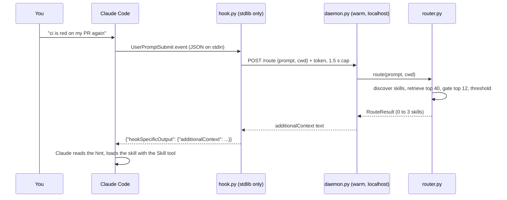

# How skill-issue works

A tour of the code for anyone who wants to change it. The README covers what it does and how to
install it; this page follows one prompt through the system and maps each step to a file.

## One prompt, start to finish

1. **Claude Code runs the hook.** `hooks/hooks.json` registers `hooks/run-hook.sh` for
   `SessionStart` and `UserPromptSubmit`. The shell script finds a Python (the plugin's own venv,
   then the one recorded in `~/.skill-issue/python.txt`, then `python3`) and runs
   `src/skillissue/hook.py` with `-I -S`, so it imports nothing but the standard library and
   starts fast (the process floor is in the README's latency table).
2. **The hook asks the daemon.** `hook.py` reads `~/.skill-issue/run/daemon.json` (port, pid,
   token), posts the prompt to `http://127.0.0.1:<port>/route` and waits at most
   `SKILL_ISSUE_HOOK_TIMEOUT_MS` (1,500 ms). If the daemon is not running it starts one in the
   background (guarded by `run/spawn.lock`) and prints nothing for this prompt. A timeout also
   prints nothing; only a refused connection or a dead pid counts as "daemon gone". Every failure
   path exits 0 with empty output, so your prompt is never blocked.
3. **The daemon keeps the models warm.** `daemon.py` is a `ThreadingHTTPServer` bound to
   127.0.0.1 with a random per-start token. It loads the embedder and the gate in a background
   thread (`/health` says `loading` until then, `/route` answers 503) and shuts itself down after
   `daemon.idle_timeout_min` without requests.
4. **The router does the work.** `router.py`:
   - `discover.py` lists every skill the agent could load: `~/.claude/skills`, the project's
     `.claude/skills`, skills of enabled Claude Code plugins, and `.agents/skills`. Skills marked
     `disable-model-invocation` are skipped. In approved mode the vetted public index is merged in.
   - The catalog is fingerprinted (SKILL.md paths, sizes and modification times), so the BM25 index and the
     embeddings are rebuilt only when a skill changes. Embeddings are cached on disk by content hash.
   - `retrieval.py` scores every skill with BM25 over name, description and body and with
     `bge-small-en-v1.5` embeddings, fuses the two rankings with reciprocal rank fusion, and keeps
     the top 40.
   - `gates/` scores the top 12 candidates in one batch. Each score is an independent
     "is this skill relevant to this request?" judgment, turned into a probability by Platt
     scaling (`gates/base.py: Calibration`).
   - Skills above the threshold are kept, three at most. Often nothing clears it, and nothing is
     injected.
5. **The hint.** `inject.py` renders the `<skill-issue>` block: skill names, probabilities and
   descriptions, plus an instruction to load the ones that fit. For skills that are not installed
   (approved mode) the block says so and tells the agent never to install anything itself.

## Code map

| File | Role |
|---|---|
| `src/skillissue/skill.py` | `Skill` dataclass, SKILL.md frontmatter parsing, content hashing |
| `src/skillissue/discover.py` | which skills are installed, per source |
| `src/skillissue/retrieval.py` | BM25 index, embedder wrapper, embedding cache, hybrid retriever |
| `src/skillissue/gates/` | the gate interface and implementations (cross-encoder, Laya, retrieval-only, TypeSafe) |
| `src/skillissue/gates/__init__.py` | `load_gate(cfg)`: picks the gate, model and device; `auto` means fine-tuned gte on GPU/MPS, fine-tuned MiniLM on CPU |
| `src/skillissue/models.py` | model downloads: Hugging Face repos, and release zips pinned by SHA-256 with fallback to the base model |
| `src/skillissue/router.py` | glues discovery, retrieval, gate and threshold; returns a `RouteResult` |
| `src/skillissue/inject.py` | the text the agent sees |
| `src/skillissue/daemon.py` | warm HTTP server on localhost |
| `src/skillissue/hook.py` | the stdlib-only Claude Code hook |
| `src/skillissue/mcp_server.py` | `find_skills` and `explain_route` over MCP, for agents without prompt hooks |
| `src/skillissue/approved/` | the vetted public index, static scanner, and confirm-first installer |
| `src/skillissue/cli.py` | the `skill-issue` command |
| `src/skillissue/config.py`, `paths.py` | config file with defaults; everything lives under `~/.skill-issue` |
| `hooks/`, `.claude-plugin/`, `skills/skill-issue/` | the Claude Code plugin, marketplace entry, and companion skill |

## Where state lives

Everything is under `~/.skill-issue` (or `$SKILL_ISSUE_HOME`):

| Path | What |
|---|---|
| `config.toml` | your settings (`skill-issue config show`) |
| `models/` | downloaded weights, one folder per model |
| `index/` | skill embeddings keyed by content hash |
| `run/daemon.json` | the running daemon's port, pid and token (the hook reads this) |
| `run/daemon.log` | daemon log |
| `python.txt` | which Python the hook should use |
| `approved/` | approved-mode state |

Nothing is written to `~/.claude` except by Claude Code itself when you install the plugin, and
by `skill-issue install` when you confirm an approved skill.

## Adding a gate

1. Subclass `Gate` in `src/skillissue/gates/` and implement
   `raw_scores(prompt, candidates) -> np.ndarray` (higher means more relevant).
2. Register it in `load_gate` and `GATE_NAMES` in `gates/__init__.py`.
3. Add it to `bench/systems.py`, run `python -m bench.run --systems <name>`: that fits its
   calibration and threshold on the validation split and reports the test split at every catalog
   size.

## The benchmark pipeline

| Step | Script | Output |
|---|---|---|
| Skill pool (8 pinned repos + SkillRet) | `bench/corpus.py` | `data/corpus/`, `.cache/` |
| Core skills and cluster splits | `bench/select_core.py` | `data/bench/core.json` |
| Prompts (LLM-written, validated) | `bench/gen_batches.py`, `bench/build_dataset.py` | `data/bench/{train,val,test}.jsonl` |
| Catalogs of 10 to 18,719 skills | `bench/catalogs.py` | built on the fly, seeded |
| All systems, all sizes | `bench/run.py` | `bench/results/<system>.json` |
| Fine-tuning pairs and training | `training/build_pairs.py`, `training/finetune_cross.py`, `training/finetune_laya.py` | `checkpoints/` |
| GPU batch jobs (Colab or local) | `cloud/prepare.py`, `cloud/local.sh`, `cloud/ingest.py` | merged into the caches above |
| SkillRet external set | `bench/skillret_eval.py` | `bench/results/skillret.json` |
| Claude Code with and without the router | `bench/agent_baseline.py`, `bench/agent_paired.py` | `bench/results/agent/` |
| Latency | `bench/gate_latency.py`, `bench/hook_latency.py` | `bench/results/` |
| Charts and README tables | `bench/report.py` | `assets/charts/`, `docs/results.md`, README |

Method details and the leakage precautions are in [benchmark.md](benchmark.md).
